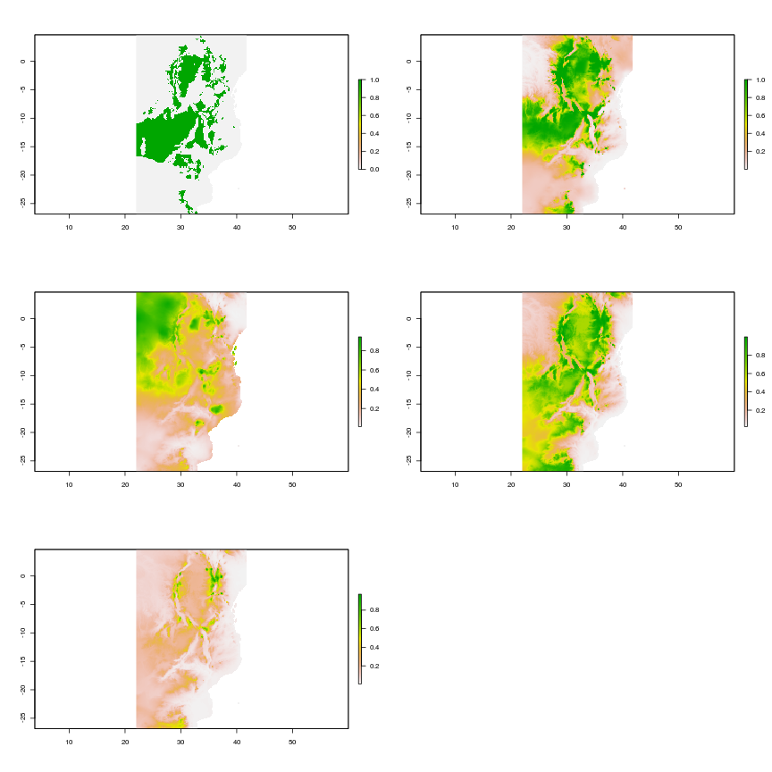
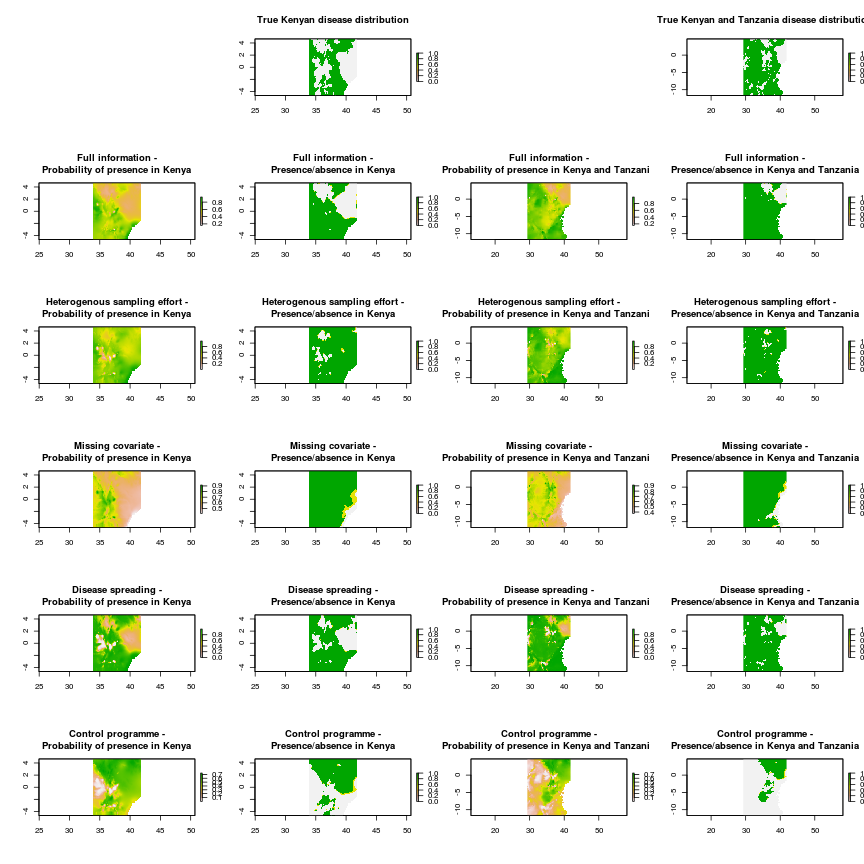

Epidemiological distribution model simulations
================================================

The folling demonstrates the potential pitfalls in modelling disease distributions using a virtual disease. The disease niche is set according to several environmental criteria and is modelled in a number of simulated scenarios. Some of the problems demonstrated below are well known in the ecological literature but the nature of these problems is often framed differently in epidemiological research and so should be highlighted in this particular context. The criteria for suitabile areas for this vitrual disease will be as follows:

* Between 150m and 993m asl
* Mean temperature between 19.0 and 26.5 degrees C
* Precipitation above 10 and below 200

 

As the disease in this case is virtual, we are sure of the fundamental niche of this species and can assess model predictions for each of the scenarios against a known baseline (Figure 1). The environmental data used below are real data from Africa which is used as the geographic area for the examples. The environmental predictors in this example come from WORLDCLIM and are cropped to the extent of the African continent (Figure 2). This is an appropriate choice as many of the diseases to which SDMs have been applied are present on the continent and it is likely that these mthods will continue to be applied to this region. In this demonstrated the following scenarios are simulated and assessed:

* _Full information_ - The disease is in equilibrium with its environment and data is available for a spatially representative sample of its range
* _Heterogenous sampling effort_ - The disease is in equilibrium with its environment but there is spatial bias in the detection of the disease (i.e. a heterogenous sampling effort)
* _Missing covariates_ - The disease is in equilibrium with its environment and there is a spatially representative sample available but the covariates used for prediction do not fully reflect the species environmental constraints
* _Disease spreading_ - The disease is not in equilibrium with its environment (i.e. the disease is spreading geographically and suitable areas exist outside of the realised niche)
* _Control programme_ - The disease is not in equilibrium with its environment due to disease control (i.e. there are FALSE negatives in the data)

 

Fieldwork for our modelling scenarios (Figure 3) constists of selecting random points as follows for the five scenarios:

* _Full information_ - 300 random points are sampled from the true binary distribution of the disease at its full extent
* _Heterogenous sampling effort_ - 200 random points are sampled from the true disease distribution within Kenya and a further 100 points from the rest of Africa 
* _Missing covariates_ - 300 random points are sampled from the true binary distribution of the disease at its full extent
* _Disease spreading_ - 300 random points are selected from within Kenya alone and the model is then projected onto Africa
* _Control programme_ - 150 random points are selected from within Kenya and a further 150 random points from within Tanzania where the disease has been eradicated. This model is then projected onto the whole of Africa

 

For each senario potential covariates were tested for collinearity. Generally the various measures of temperature were correlated strongly (Pearson's c > 0.5) with each other as well as precipitation. In these cases, precipitation was retained within the models as it was less strongly correlated with altitude (Pearson's c < 0.5 in all but one case). Generalised linear models are fitted for each of the scenarios using predictor variables as follows:

* _Full information_ - Altitude and annual mean precipitation
* _Heterogenous sampling effort_ - Altitude and annual mean precipitation
* _Missing covariates_ - Altitude and  mean temperature of the wettest quarter
* _Disease spreading_ - Altitude and annual mean precipitation (correlation coefficent of 0.53 but still lower than other candidate variables)
* _Control programme_ - Altitude and annual mean precipitation

In all but one case the best model interms of the lowest AIC score included an interaction between mean precipitation per year and altitude. In the _missing covariates_ scenario the best model used only altitude as a predictor, however, the model including both altitude and mean precipitation in the wettest quarter had delta AIC < 2 so this mdoel was chosen for illustration purposes.

Model evaluation is an important step in distribution modelling. In terms of prediction this should probably involve calculating more than one metric for evauluation but in this case, we will use one as we know the full distribution of the disease and have the luxury of being able to use random samples from the known distribution for testing rather than a subset of collected data. The receiver operating characteristic curve plots the rate of true positive results versus false positive. The area under this curve (AUC) provides a single value which represents the predictive performance of the model. The value is between 0 and 1 and bvalues above 0.5 represent better than random predictions with values over 0.7 conidered to indicate a "good" predictive model. The use of AUC values has been criticised in the literature recently but nevertheless is a commonly used method of model evaluation in the ecological literature (Fielding and Bell 1997). In each case the models are tested for predictive accuracy by converting their predictions into binary values (present or absent) and testing these against the true values for 1000 randomly selected points across Africa.

ROC curves and AUC scores for these modelling scenarios (Figure 4) suggest that the best performing model in this case is the _heterogenous sampling effort_ scenarios, however, this is only slightly better than the _full information_ scenario. The worst perfroming model by AUC score is the _control programme_ scenario which performs worse than random. However, the _missing covariates_ model only has an AUC of 0.5 becasue it produced no positive predictions (i.e. true positives = true negatives = 0).

 

By projecting the models onto data for the whole of Africa we can visually assess the performance of these models compared to the true distribution of the virtual disease (Figure 5). One feature of note is that the _missing covariates_ model predicts a noticeably lower probability of presence and for a much wioder area than the other models. Also the model representing a _control programme_ predicts a very low probability of presence in central Africa where we know the disease to be present. The model using _full information_ predicts a wider area than the true distribution of the model to have a high proabability of presence. This could be due to the lqack of temeprature based predictors iin the model of becuse, as precipitation has a threshold over which it is suitable, the model would be imporved with the inclusion of nonlinear relationships. The _heterogenous sampling effort_ model predicts a similar shaped area to the full information model but with a higher probability of presence outside of the true distribution. The _disease spreading_ model predicts apatchy distribution covering some of the areas where the disease is known to be present but several further areas where the disease is absent including north Africa and the middle east. 

 

Converting these  to binary predictions shows where these models predict the disease to be present or absent (Figure 6). The _full information_ model is broad in its predictions in central and west africa and misses some of the peripheral areas where the disease is present.  The _heterogenous sampling effort_ model is similar in this regard. The _missing covariates_ model cannot predict any areas of presence and perfromas the worst out of all the scenarios. The _disease spreading_ model predicts several areas where the disease is present but also patches such as the west of of southern Africa wjich are, in fact, unsuitable. The _control programme_ model performs poorly and predicts large areas which are unsuitable for the disease as present along with much of the true distribution as absent.

 

As some of these models were fitted to data from a restricted geopgraphic area it is also worthwile in inspecting and comparing theri performances across Kenya and the combined Kenya and Tanzania area (Fig 7). 

 

The results of these projections are based on randomly placed points so there is the potential for variations in the modelling outcomes fo each scenario. To investigate the variability in these results and compare across scenarios the models are repeated 100 times each and assessed in terms of AUC azlong with the proportion of the study area correct, the proportion of false negative produced and the proportion of false positives.

 

 

 

