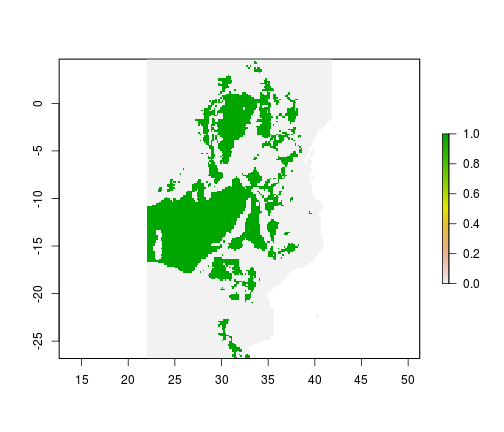
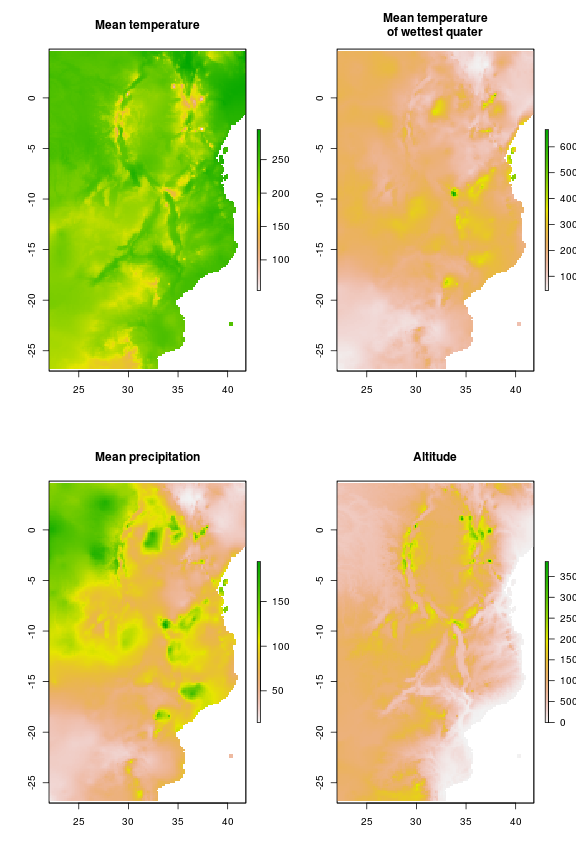
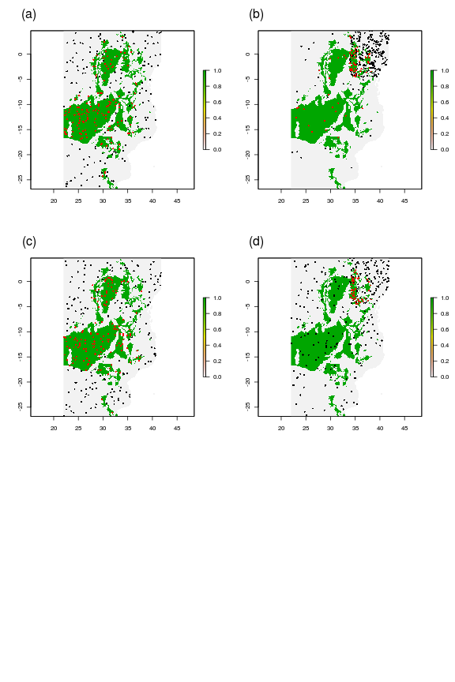

Epidemiological distribution model simulations
================================================

The folling demonstrates the potential pitfalls in modelling disease distributions using a virtual disease. The disease niche is set according to several environmental criteria and is modelled in a number of simulated scenarios. Some of the problems demonstrated below are well known in the ecological literature but the nature of these problems is often framed differently in epidemiological research and so should be highlighted in this particular context. The criteria for suitabile areas for this vitrual disease will be as follows:

* Between 150m and 993m asl
* Mean temperature between 19.0 and 26.5 degrees C
* Precipitation above 10

 

As the disease in this case is virtual, we are sure of the fundamental niche of this species and can assess model predictions for each of the scenarios against a known baseline (Figure 1). The environmental data used below are real data from Africa which is used as the geographic area for the examples. The environmental predictors in this example come from WORLDCLIM and are cropped to the extent of the African continent (Figure 2). This is an appropriate choice as many of the diseases to which SDMs have been applied are present on the continent and it is likely that these mthods will continue to be applied to this region. In this demonstrated the following scenarios are simulated and assessed:

* _Full information_ - The disease is in equilibrium with its environment and data is available for a spatially representative sample of its range
* _Heterogenous sampling effort_ - The disease is in equilibrium with its environment but there is spatial bias in the detection of the disease (i.e. a heterogenous sampling effort)
* _Missing covariates_ - The disease is in equilibrium with its environment and there is a spatially representative sample available but the covariates used for prediction do not fully reflect the species environmental constraints
* _Disease spreading_ - The disease is not in equilibrium with its environment (i.e. the disease is spreading geographically and suitable areas exist outside of the realised niche)
* _Control programme_ The disease is not in equilibrium with its environment due to disease control (i.e. there are FALSE negatives in the data)

 

Fieldwork for our modelling scenarios (Figure 3) constists of selecting random points as follows for the five scenarios:

* _Full information_ - 300 random points are sampled from the true binary distribution of the disease at its full extent
* _Heterogenous sampling effort_ - 200 random points are sampled from the true disease distribution within Kenya and a further 100 points from the rest of Africa 
* _Missing covariates_ - 300 random points are sampled from the true binary distribution of the disease at its full extent
* _Disease spreading_ - 300 random points are selected from within Kenya alone and the model is then projected onto Africa
* _Control programme_ 150 random points are selected from within Kenya and a further 150 random points from within Tanzania where the disease has been eradicated. This model is then projected onto the whole of Africa

 

