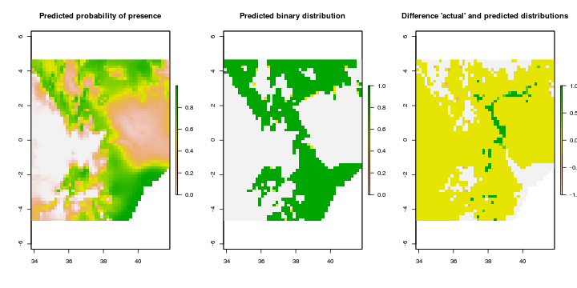
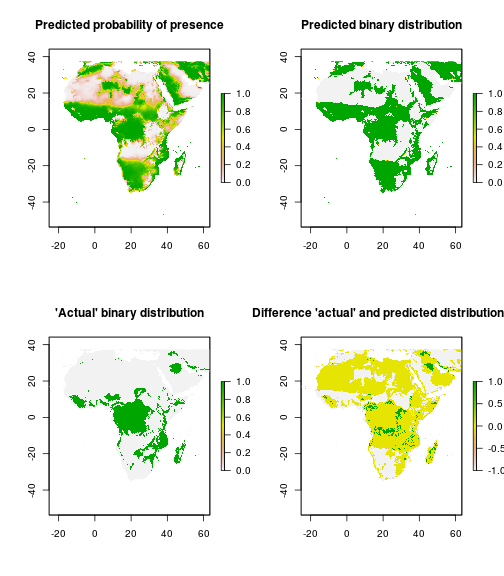

Simulating Epidemiological distribution models
========================================================

We'll need the following packages for these simulations.


First we load data for the african continent and environmental variables from WORLDCLIM. These are cropped to cover our region of interest


```r
# Read in continental outline
africa.shp <- readShapeSpatial("africa.shp", proj4string = CRS("+proj=longlat +ellps=WGS84 +datum=WGS84 +no_defs"))
kenya <- getData("GADM", country = "KEN", level = 0)

# Read in global data
global.mean.temp <- getData("worldclim", var = "tmean", res = 10)
global.min.temp <- getData("worldclim", var = "tmin", res = 10)
global.max.temp <- getData("worldclim", var = "tmax", res = 10)
global.bio <- getData("worldclim", var = "bio", res = 10)
global.precip <- getData("worldclim", var = "prec", res = 10)
global.alt <- getData("worldclim", var = "alt", res = 10)

# Crop to africa extent
africa.mean.temp <- crop(global.mean.temp, extent(africa.shp))
africa.min.temp <- crop(global.min.temp, extent(africa.shp))
africa.max.temp <- crop(global.max.temp, extent(africa.shp))
africa.bio <- crop(global.bio, extent(africa.shp))
africa.precip <- crop(global.precip, extent(africa.shp))
africa.alt <- crop(global.alt, extent(africa.shp))

# Find mean values for temperature and precipitation
mean.temp.yr <- mean(africa.mean.temp)
min.temp.yr <- max(africa.max.temp)
max.temp.yr <- min(africa.min.temp)
precip.yr <- mean(africa.precip)
```


Plot these data

 


Now we reclass the bioclimatic maps to find areas which fit into a pre-determined threshold.
As an example we'll use:

* Between 506m and 993m asl
* Mean temperature between 23.9 and 26.5 degrees C
* Precipitation above 10

To do this we'll reclass the three maps and combine them to find the suitable and unsuitable areas in a binary map


```r
rcl <- matrix(c(0, 238.999, 0, 238.9999, 265, 1, 256.0001, 315, 0), nrow = 3, 
    ncol = 3, byrow = T)
bin.mean.temp <- reclassify(mean.temp.yr, rcl)

rcl <- matrix(c(-354, 505.999, 0, 505.9999, 993, 1, 993.0001, 3884, 0), nrow = 3, 
    ncol = 3, byrow = T)
bin.alt <- reclassify(africa.alt, rcl)

rcl <- matrix(c(0, 9.999, 0, 9.9999, 365, 1), nrow = 2, ncol = 3, byrow = T)
bin.precip <- reclassify(precip.yr, rcl)

rcl <- matrix(c(0, 2.999, 0, 2.9999, 3, 1), nrow = 2, ncol = 3, byrow = T)
bin.suit <- reclassify((bin.mean.temp + bin.alt + bin.precip), rcl)
```


Plot the suitable area

 


We can now take random points from the extent of Africa to be our presence and absence points for the model of suitability across Africa using the randomPoints() funtion in dismo. We can then extract the values of the predictor variables for these points.

Now weed need a subset of the environmental variables to simulated a sampling excercise with limited geographic area. We will use Kenya as our sampling area.


```r
# Crop to Kenya extent
kenya.mean.temp <- crop(mean.temp.yr, extent(kenya))
# kenya.min.temp <- crop(min.temp.yr, extent(kenya)) kenya.max.temp <-
# crop(max.temp.yr, extent(kenya)) kenya.bio <- crop(africa.bio,
# extent(kenya))
kenya.precip <- crop(precip.yr, extent(kenya))
kenya.alt <- crop(africa.alt, extent(kenya))

# Crop binary suitability map to Kenya extent
kenya.bin <- crop(bin.suit, extent(kenya))

# Take samples from kenya

kenya.points <- randomPoints(kenya.bin, 500)
kenya.pres <- cbind(kenya.points, pa = extract(kenya.bin, kenya.points))
kenya.pres <- as.data.frame(kenya.pres)
ab <- which(kenya.pres$pa == 0)
kenya.pres <- kenya.pres[-c(sample(ab, length(ab) * 0.6)), ]
rm(ab)
```


Let's take a quick look at our fieldwork...

 


Extract environmental variables from presence/absence points

```r

kenya.data <- data.frame(presence = numeric(length(kenya.pres$pa)), mean.temp.yr = numeric(length(kenya.pres$pa)), 
    min.temp.yr = numeric(length(kenya.pres$pa)), max.temp.yr = numeric(length(kenya.pres$pa)), 
    precip.yr = numeric(length(kenya.pres$pa)), africa.alt = numeric(length(kenya.pres$pa)))

kenya.data$presence <- kenya.pres$pa
kenya.data$mean.temp.yr <- extract(mean.temp.yr, kenya.pres[, 1:2])
kenya.data$max.temp.yr <- extract(max.temp.yr, kenya.pres[, 1:2])
kenya.data$min.temp.yr <- extract(min.temp.yr, kenya.pres[, 1:2])
kenya.data$precip.yr <- extract(precip.yr, kenya.pres[, 1:2])
kenya.data$africa.alt <- extract(africa.alt, kenya.pres[, 1:2])
```


Candidate models... 


```r
mod.1 <- glm(presence ~ mean.temp.yr, data = kenya.data, family = "binomial")
mod.2 <- glm(presence ~ precip.yr, data = kenya.data, family = "binomial")
mod.3 <- glm(presence ~ africa.alt, data = kenya.data, family = "binomial")
mod.4 <- glm(presence ~ mean.temp.yr + africa.alt, data = kenya.data, family = "binomial")
mod.5 <- glm(presence ~ precip.yr + africa.alt, data = kenya.data, family = "binomial")
mod.6 <- glm(presence ~ precip.yr * mean.temp.yr, data = kenya.data, family = "binomial")
mod.7 <- glm(presence ~ mean.temp.yr * africa.alt, data = kenya.data, family = "binomial")
mod.8 <- glm(presence ~ precip.yr * africa.alt, data = kenya.data, family = "binomial")
mod.9 <- glm(presence ~ mean.temp.yr * precip.yr, data = kenya.data, family = "binomial")
```

This is overly simplistic (ignoring spatial autocorrelation etc.) but we can find the best model here using AIC. In fact mean temperature and altitude are far too correlated; we might have to deal with this and use a different model.


```r
AIC.vals <- data.frame(mod = c("mod.1", "mod.2", "mod.3", "mod.4", "mod.5", 
    "mod.6", "mod.7", "mod.8", "mod.9"), AIC = c(AIC(mod.1), AIC(mod.2), AIC(mod.3), 
    AIC(mod.4), AIC(mod.5), AIC(mod.6), AIC(mod.7), AIC(mod.8), AIC(mod.9)), 
    d.AIC = numeric(9))
AIC.vals$d.AIC <- AIC.vals$AIC - min(AIC.vals$AIC)
print(AIC.vals)
```

```
##     mod    AIC  d.AIC
## 1 mod.1 272.86 175.21
## 2 mod.2 253.15 155.50
## 3 mod.3 275.96 178.31
## 4 mod.4 273.24 175.59
## 5 mod.5 253.27 155.62
## 6 mod.6 176.69  79.04
## 7 mod.7  97.65   0.00
## 8 mod.8 211.11 113.45
## 9 mod.9 176.69  79.04
```


O.K., so for now we'll use the model using an interaction between mean temperature and altitude (ignoring the problems for the sake of example).

To predict the distribution across Kenya we need to convert the Kenyan environmental data to a data frame


```r

# Create a dataframe for the raster data

kenya.env <- data.frame(mean.temp.yr = numeric(2688), precip.yr = numeric(2688), 
    alt = numeric(2688))

kenya.env$mean.temp.yr <- values(kenya.mean.temp)
kenya.env$precip.yr <- values(kenya.precip)
kenya.env$africa.alt <- values(kenya.alt)
```


Calculate the predicted values for Kenya


```r
pred <- predict(mod.7, kenya.env, type = "response")
pred.map <- raster(matrix(pred, nrow = nrow(kenya.alt), ncol = ncol(kenya.alt), 
    byrow = T), template = kenya.bin)
```

We can look at the the predicted presence of disease in kenya by plotting out predicted map. It might also be useful to convery our probability of presence to a binary presence/absence map and compare this to the presence/absence map we created using our threshold rules.

 

First we can test the model using some random "test points". We'll use the ROC curve and AUC to test, again for simplicity, ignoring for the moment problems with these described in the literature.

The steps are as follows:  
* Generate 300 random test points (_test.pts_)  
* Extract the predicted values from our model as _test.mod_  
* Extract the actual values from our binary presence/absence map of Kenya as _test.vals_  
* Use the prediction function from the ROCR package to assess the accuracy of the prediction  
* Use the performance function to calculate values for the ROC curve  
* Calculate the AUC using the performance function again but with different options  


```r
test.pts <- randomPoints(pred.map, 300)
test.mod <- extract(pred.bin, test.pts)
test.vals <- extract(kenya.bin, test.pts)

pred.test <- prediction(test.mod, test.vals)
perf.test <- performance(pred.test, "tpr", "fpr")
AUC <- performance(pred.test, "auc")@y.values[[1]]
```


Now we can plot the curve and resist the temptation to "coulourize it"!  
We'll also add the AUC to the plot for reference

 


Apart from the obvious issues with the model itself, as an example the model looks good. 

Now we want to project the model from Kenya onto the whole of Africa. 


```r

# Create a dataframe for the african raster data

africa.env <- data.frame(mean.temp.yr = numeric(270231), precip.yr = numeric(270231), 
    alt = numeric(270231))

africa.env$mean.temp.yr <- values(mean.temp.yr)
africa.env$precip.yr <- values(precip.yr)
africa.env$africa.alt <- values(africa.alt)

# Predict values from our model and binary prediction map

africa.pred <- predict(mod.7, africa.env, type = "response")
africa.pred.map <- raster(matrix(africa.pred, nrow = nrow(africa.alt), ncol = ncol(africa.alt), 
    byrow = T), template = bin.suit)
africa.pred.bin <- reclassify(africa.pred.map, matrix(c(0, 0.49, 0, 0.5, 1, 
    1), nrow = 2, ncol = 3, byrow = T))
```


It's also probably worth using the evaluation method from before to get an idea of the quality of these predictions.


```r
africa.test.pts <- randomPoints(africa.pred.map, 300)
africa.test.mod <- extract(africa.pred.bin, africa.test.pts)
africa.test.vals <- extract(bin.suit, africa.test.pts)

africa.pred.test <- prediction(africa.test.mod, africa.test.vals)
africa.perf.test <- performance(africa.pred.test, "tpr", "fpr")
africa.AUC <- performance(africa.pred.test, "auc")@y.values[[1]]
```


Now we can plot the curve and resist the temptation to "coulourize it"!  
We'll also add the AUC to the plot for reference

 


Still, just about, a 'good' model (AUC above 0.7) but this is likely to be due to the agreement of absence points in large areas of completely unsuitable parts of Africa. 

We can plot these maps to invesitgate whether the model is accurate on a continental scale and see where it gets things right/wrong...

 


It looks like the model predicts big chunks of North Africa, a larger area in Central Africa and the coast of South Africa when they are not. This could be due to the lack of the precipitation variable in the model. It is also likely to result from using a subset of values to train the model in Kenya. 
