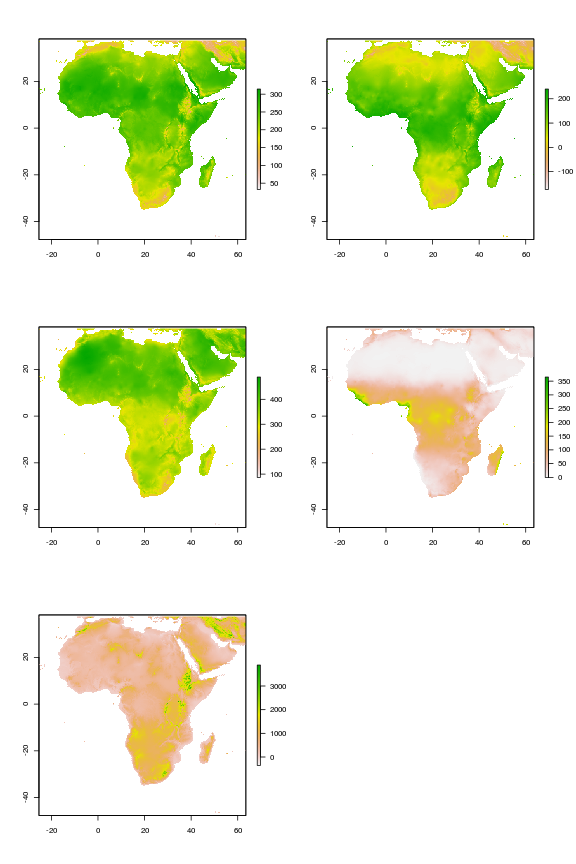
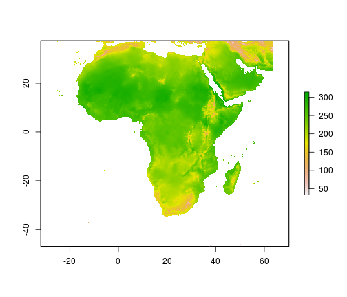

Simulating Epidemiological distribution models
========================================================

We'll need the following packages for these simulations.


```r
library(maptools)
```

```
## Loading required package: foreign
```

```
## Loading required package: sp
```

```
## Loading required package: grid
```

```
## Loading required package: lattice
```

```
## Checking rgeos availability: TRUE
```

```r
library(sp)
library(raster)
library(dismo)
library(rgdal)
```

```
## rgdal: version: 0.8-9, (SVN revision 470) Geospatial Data Abstraction
## Library extensions to R successfully loaded Loaded GDAL runtime: GDAL
## 1.9.2, released 2012/10/08 Path to GDAL shared files: /usr/share/gdal/1.9
## Loaded PROJ.4 runtime: Rel. 4.8.0, 6 March 2012, [PJ_VERSION: 480] Path to
## PROJ.4 shared files: (autodetected)
```


First we load data for the african continent and environmental variables from WORLDCLIM. These are cropped to cover our region of interest


```r
# Read in continental outline
africa.shp <- readShapeSpatial("africa.shp", proj4string = CRS("+proj=longlat +ellps=WGS84 +datum=WGS84 +no_defs"))
kenya <- getData("GADM", country = "KEN", level = 0)

# Read in global data
mean.temp <- getData("worldclim", var = "tmean", res = 10)
min.temp <- getData("worldclim", var = "tmin", res = 10)
max.temp <- getData("worldclim", var = "tmax", res = 10)
bio <- getData("worldclim", var = "bio", res = 10)
precip <- getData("worldclim", var = "prec", res = 10)
alt <- getData("worldclim", var = "alt", res = 10)

# Crop to africa extent
africa.mean.temp <- crop(mean.temp, extent(africa.shp))
africa.min.temp <- crop(min.temp, extent(africa.shp))
africa.max.temp <- crop(max.temp, extent(africa.shp))
africa.bio <- crop(bio, extent(africa.shp))
africa.precip <- crop(precip, extent(africa.shp))
africa.alt <- crop(alt, extent(africa.shp))
```


Plot these data


```r
plot(africa.mean.temp)
```

 


```r
plot(africa.alt)
```

 

